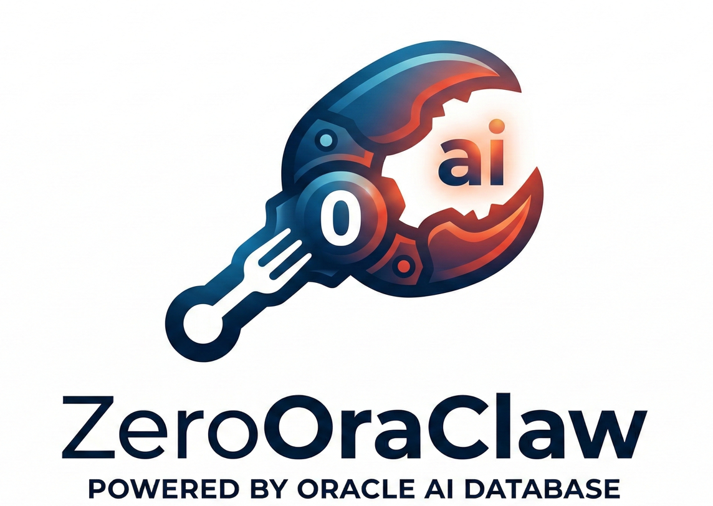

<p align="center">
  
</p>

<h1 align="center">ZeroOraClaw</h1>

<p align="center">
  <strong>Oracle AI Database-powered AI assistant.</strong> Zero overhead. Zero compromise. 100% Rust.
</p>

<p align="center">
  <a href="LICENSE-APACHE"></a>
  <a href="https://github.com/jasperan/zerooraclaw"></a>
  
</p>

---

ZeroOraClaw is a fork of [ZeroClaw](https://github.com/jasperan/zerooraclaw) that replaces **ALL** storage backends with **Oracle AI Database** as the exclusive persistence layer. Every byte of memory, session, state, and embedding lives in Oracle.

## Why Oracle AI Database?

- **In-Database ONNX Embeddings**: Generate 384-dim vectors with `VECTOR_EMBEDDING()` -- zero API calls, zero latency
- **AI Vector Search**: Semantic recall via `VECTOR_DISTANCE()` with COSINE similarity
- **ACID Transactions**: No data loss on crash, ever
- **Multi-Agent Isolation**: Each agent gets its own namespace via `agent_id`
- **Enterprise-Grade**: Connection pooling, automatic indexing, audit trails

## Features

- Everything from ZeroClaw: 30+ LLM providers, 18+ chat channels, tools, skills, robotics
- Oracle AI Database as exclusive storage (no SQLite, no PostgreSQL, no files)
- In-database ONNX embeddings (ALL_MINILM_L12_V2)
- 8 persistent tables (ZERO_* prefix) with vector indexes
- `setup-oracle` CLI for one-command database setup
- `oracle-inspect` CLI dashboard for database inspection
- Docker Compose with Oracle Database Free
- Supports both FreePDB (local) and Autonomous Database (cloud)

## Quick Start

### Prerequisites

- Rust 1.87+
- Oracle Database Free (Docker) or Oracle Autonomous Database
- Oracle Instant Client (for building)

### 1. Build

```bash
cargo build --release
```

### 2. Start Oracle Database

```bash
./scripts/setup-oracle.sh
# Or manually:
docker compose up oracle-db -d
```

### 3. Initialize

```bash
./target/release/zerooraclaw setup-oracle
./target/release/zerooraclaw onboard
```

### 4. Chat

```bash
./target/release/zerooraclaw agent -m "Hello! Remember that I love Rust."
./target/release/zerooraclaw agent -m "What programming language do I like?"
```

### 5. Inspect

```bash
./target/release/zerooraclaw oracle-inspect
./target/release/zerooraclaw oracle-inspect memories --search "programming"
```

## Docker Compose

```bash
# Full stack: Oracle DB + ZeroOraClaw
docker compose up -d

# With custom API key
API_KEY=sk-... docker compose up -d

# Oracle DB only (for local development)
docker compose up oracle-db -d
```

The Oracle Database Free container takes approximately 2 minutes to initialize on first start. The `zerooraclaw` service will wait for it to become healthy before starting.

## Oracle Schema

| Table | Purpose | Key Feature |
|---|---|---|
| ZERO_META | Schema version | Single row per agent |
| ZERO_MEMORIES | Long-term memories | VECTOR(384) + COSINE index |
| ZERO_DAILY_NOTES | Daily journal | VECTOR(384) + COSINE index |
| ZERO_SESSIONS | Chat history | JSON CLOB per channel |
| ZERO_TRANSCRIPTS | Full audit log | IDENTITY sequence PK |
| ZERO_STATE | Agent K-V state | Composite PK |
| ZERO_CONFIG | Config snapshots | JSON CLOB |
| ZERO_PROMPTS | System prompts | Seeded from workspace |

## Configuration

```toml
# ~/.zerooraclaw/config.toml

[oracle]
mode = "freepdb"           # freepdb | adb
host = "localhost"
port = 1521
service = "FREEPDB1"
user = "zerooraclaw"
password = "ZeroOraClaw2026"
onnx_model = "ALL_MINILM_L12_V2"
agent_id = "default"
```

See `config/config.example.toml` for the complete reference with all available options.

### Environment Variables

Oracle connection settings can also be configured via environment variables:

| Variable | Description | Default |
|---|---|---|
| `ZEROORACLAW_ORACLE_HOST` | Database hostname | `localhost` |
| `ZEROORACLAW_ORACLE_PORT` | Listener port | `1521` |
| `ZEROORACLAW_ORACLE_SERVICE` | Service name | `FREEPDB1` |
| `ZEROORACLAW_ORACLE_USER` | Database user | `zerooraclaw` |
| `ZEROORACLAW_ORACLE_PASSWORD` | Database password | -- |
| `API_KEY` | LLM provider API key | -- |
| `PROVIDER` | LLM provider name | `ollama` |

## Architecture

```
zerooraclaw
  src/
    oracle/            # Oracle AI Database integration
      connection.rs    # Connection pooling and lifecycle
      schema.rs        # 8 ZERO_* table DDL + ONNX model loading
      embedding.rs     # In-database VECTOR_EMBEDDING() service
      memory.rs        # Memory trait backed by Oracle + vector search
      session.rs       # Chat session persistence (JSON CLOB)
      state.rs         # Agent key-value state store
      config_store.rs  # Config snapshot persistence
      prompt.rs        # System prompt persistence
      vector.rs        # Vector distance helpers
      mod.rs           # Module exports
    memory/            # Memory trait definitions
    agent/             # Agent runtime loop
    cli/               # CLI commands (setup-oracle, oracle-inspect)
    ...
```

## Sister Projects

- [PicoOraClaw](https://github.com/jasperan/picooraclaw) -- Go-based, same Oracle pattern
- [OracLaw](https://github.com/jasperan/oraclaw) -- TypeScript + Python sidecar

## Credits

- [ZeroClaw](https://github.com/jasperan/zerooraclaw) -- the Rust AI agent runtime this project is forked from
- [Oracle AI Database](https://www.oracle.com/database/) -- the exclusive storage backbone

## License

MIT OR Apache-2.0

---

<div align="center">

[](https://github.com/jasperan)&nbsp;
[](https://www.linkedin.com/in/jasperan/)&nbsp;
[](https://www.oracle.com/database/free/)

</div>
