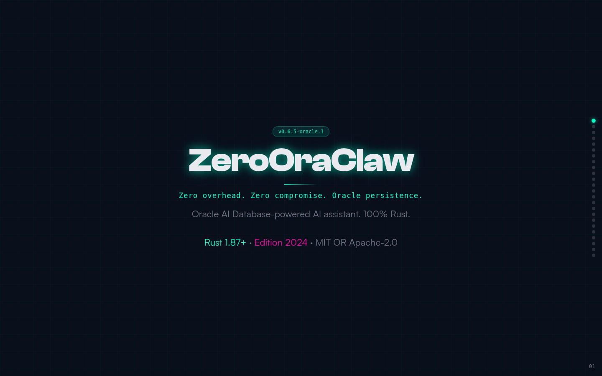
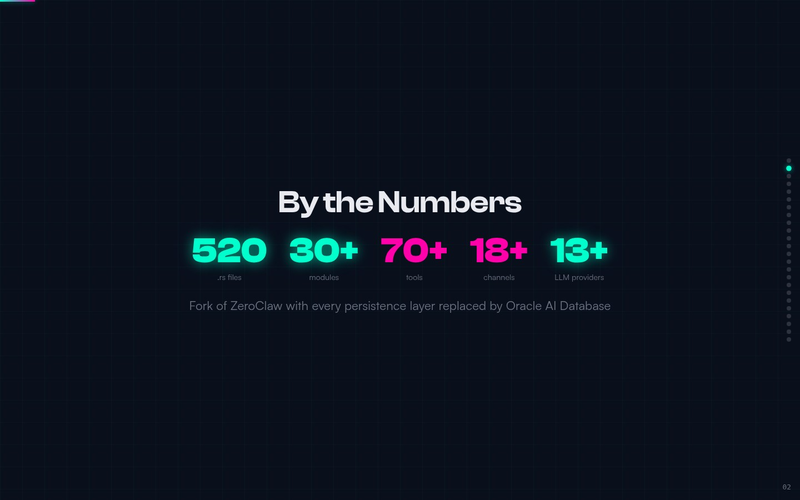
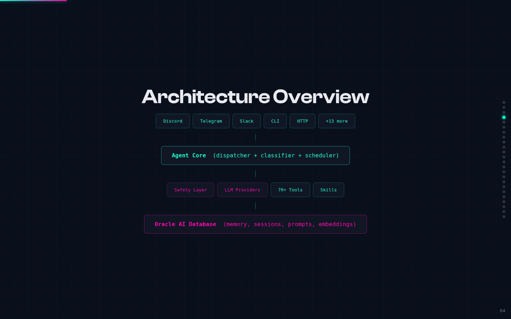
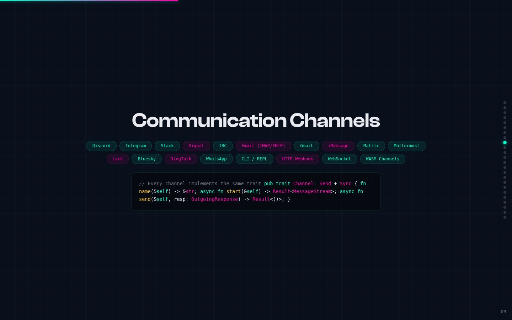
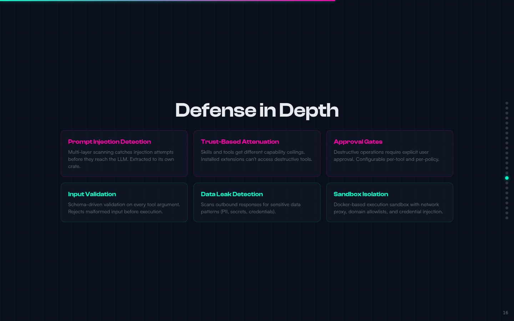
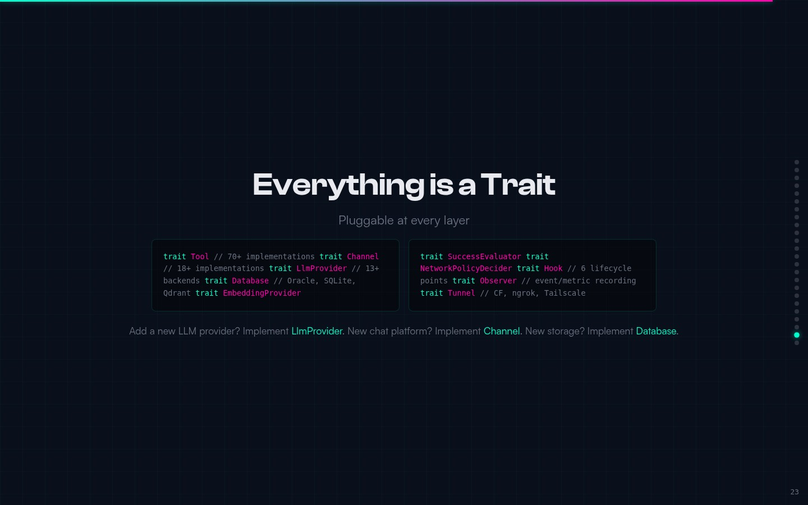

# ZeroOraClaw

Oracle AI Database-powered fork of ZeroClaw.

ZeroOraClaw keeps the current ZeroClaw runtime and ports an Oracle-first storage layer on top. The headline change is simple: memory, session state, prompts, and vector search live in Oracle AI Database instead of the default upstream persistence stack.

## Architecture at a Glance

> **Full interactive presentation**: Open [`zerooraclaw-presentation.html`](zerooraclaw-presentation.html) in your browser for all 24 slides with animations and keyboard navigation.

<table>
<tr>
<td align="center"><strong>Title</strong><br></td>
<td align="center"><strong>By the Numbers</strong><br></td>
</tr>
<tr>
<td align="center"><strong>Architecture Overview</strong><br></td>
<td align="center"><strong>18+ Channels</strong><br></td>
</tr>
<tr>
<td align="center"><strong>Defense in Depth</strong><br></td>
<td align="center"><strong>Core Traits</strong><br></td>
</tr>
</table>

## What changed in this fork

- Oracle AI Database backend added under `src/oracle/`
- New `[oracle]` config section in `config.toml`
- Oracle backend added to memory backend selection
- New CLI commands:
  - `zerooraclaw setup-oracle`
  - `zerooraclaw oracle-inspect`
- OCI deployment assets under `deploy/oci/`
- Optional OCI GenAI compatibility proxy under `oci-genai/`

## Upstream sync status

This branch is synced onto the latest upstream `zeroclaw` codebase and then re-layered with the Oracle-specific additions. That keeps the fork current without losing the Oracle integration points.

## Quick start

### Build

```bash
cargo build --release
```

### Configure Oracle

Add an `[oracle]` section to your config.

```toml
[oracle]
mode = "freepdb"
host = "localhost"
port = 1521
service = "FREEPDB1"
user = "zerooraclaw"
password = ""  # pragma: allowlist secret
onnx_model = "ALL_MINILM_L12_V2"
agent_id = "default"
max_connections = 4
```

You can also override these with environment variables:

```bash
export ZEROORACLAW_ORACLE_MODE=freepdb
export ZEROORACLAW_ORACLE_HOST=localhost
export ZEROORACLAW_ORACLE_PORT=1521
export ZEROORACLAW_ORACLE_SERVICE=FREEPDB1
export ZEROORACLAW_ORACLE_USER=zerooraclaw
export ZEROORACLAW_ORACLE_PASSWORD='your-password'  # pragma: allowlist secret
export ZEROORACLAW_ORACLE_ONNX_MODEL=ALL_MINILM_L12_V2
export ZEROORACLAW_ORACLE_AGENT_ID=default
```

### Initialize the database schema

```bash
./target/release/zerooraclaw setup-oracle
```

### Inspect Oracle-backed state

```bash
./target/release/zerooraclaw oracle-inspect
./target/release/zerooraclaw oracle-inspect memories --search "rust"
```

### Run onboarding and agent loop

```bash
./target/release/zerooraclaw onboard
./target/release/zerooraclaw agent
```

## OCI deployment

Terraform and Resource Manager assets live here:

- `deploy/oci/`

These files are fork-specific and meant to showcase Oracle Cloud deployment with Oracle-backed persistence.

## OCI GenAI proxy

Optional OpenAI-compatible proxy files live here:

- `oci-genai/`

That path is useful if you want Oracle Cloud inference and Oracle Database storage in the same stack.

## Notes

- The Rust library crate remains `zeroclaw` for compatibility with the upstream code and tests.
- The binary name for this fork is `zerooraclaw`.
- Upstream docs and architecture still inform most of the non-Oracle runtime behavior.

## Verification

This sync was validated with:

```bash
cargo check
cargo test -q
```
